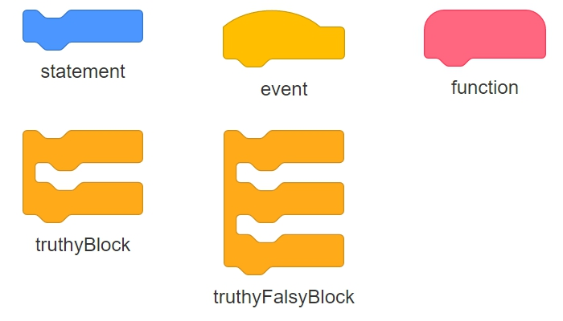

# ScratchComponent
ScratchComponent is the base (super) class to all scratch elements. Defined in ScratchComponent.js, it can be instantiated like this:
```javascript
const component = new ScratchComponent(shapeNameOrComponentInstance, options);
```

## Constructor arguments
The constructor has two parameters, they are **shapeNameOrComponentInstance** and **options** (optional).

### shapeNameOrComponentInstance
The shape name can be one of:
* **event** - Renders an event component
* **function** - Renders a function definition component
* **statement** - Renders a simple statement block
* **truthyBlock** - Renders a conditional component like *for*, *while* or *if* blocks
* **truthyFalsyBlock** - Renders a conditional block that has truthy and falsy fields like *ifElse* blocks

Every shape name is write in Camel Case. It will throw an error if the shape name is not found, but an alternative is to give another ScratchComponenet, which will duplicate even the nested components (the ones in truthy, falsy and next fields).

### Options
The options object (optional) defaults to:
```javascript
const options = {
    attributes: {
        class: '',
        id: '',
        style: {
            position: 'absolute', // relative or absolute
            width: '120px',
            'stroke-width': '1px', // border thickness
            'line-height': '24px', // height of description container
        },
    },
    fitting: {
        truthy: true, // female fitting used to connect to the truthy child next fitting
        falsy: true, // female fitting used to connect to the falsy child next fitting
        next: true, // male fitting used to connect to the next component
    },
    propagateClassNameToNestedElements: false,
    isPreview: false,
};

```

## Shapes
All available shapes are shown below:


## Containers
The image below shows the name and location of each container:


### Containers purpose
* **description** - Holds the components name and parameters if any
* **truthy** - Holds the component to be executed when **true** is evaluated
* **falsy** - Holds the component to be executed when **false** is evaluated
* **next** - Holds the next component to be executed if any

## Methods
The following methods are public:
* **getDOMNode( )**
* **getTruthyFalsyAndNext( )**
* **getShapeName( )**
* **addTruthyChild(** *childComponent* **)**
* **addFalsyChild(** *childComponent* **)**
* **addNextComponent(** *nextComponent* **)**
* **removeTruthyChild( )**
* **removeFalsyChild( )**
* **removeNextComponent( )**
* **addResizeListener(** *callbackListener* **)**
* **removeResizeListener(** *callbackListener* **)**

Any other method starting with an underscore is private and should not be called by code outside its class.

## Events
The only supported event is the resize, which is issued when the components DOM element resizes by any reason. Then, **this** reference is passed back to the registered callback listener.
